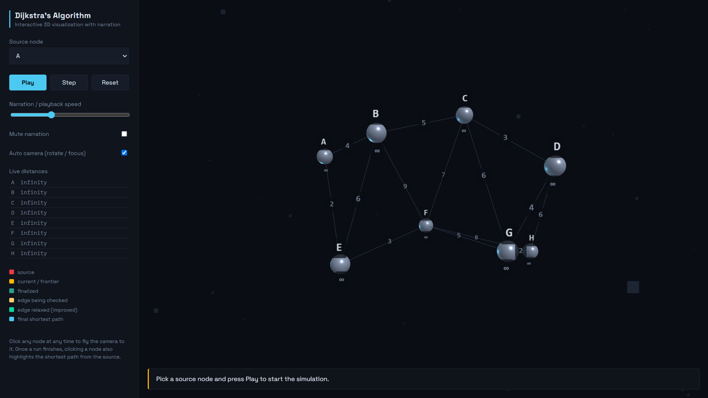

# Dijkstra's Algorithm 3D Visualizer

An interactive browser-based visualization of Dijkstra's shortest-path algorithm. The app renders a weighted, undirected graph in 3D and narrates each step as the algorithm explores, relaxes, and finalizes nodes.



## Features

- Interactive 3D graph rendered with [Three.js](https://threejs.org/)
- Select any graph node as the source
- Play, pause, step through, or reset the algorithm
- Live distance table for every node
- Visual states for the source, frontier, finalized nodes, and inspected edges
- Optional Web Speech API narration with adjustable playback speed
- Automatic camera rotation and focus controls
- Click a node after the run finishes to display its shortest path from the source
- Relaxation comparison panel showing the distance calculation for the active edge

## Getting Started

### Prerequisites

- A modern web browser with WebGL support
- Internet access when loading the page, because Three.js and OrbitControls are loaded from jsDelivr

### Run locally

This is a static website and does not require npm or a build step. From the project directory, start any local HTTP server. For example, with Python:

```bash
python -m http.server 8000
```

Then open [http://localhost:8000](http://localhost:8000) in your browser.

Opening `index.html` directly may work in some browsers, but a local server is recommended for consistent behavior.

## How to Use

1. Choose a source node from the **Source node** menu.
2. Select **Play** to run the full narrated simulation.
3. Use **Step** to advance one algorithm event at a time.
4. Adjust the narration or playback speed with the slider.
5. Enable **Mute narration** if you only want the visual trace.
6. Disable **Auto camera** to control the view manually with the mouse or trackpad.
7. After the run completes, click a node to highlight its shortest path from the selected source.

The legend in the sidebar explains the colors used during the simulation.

## Project Structure

| File | Purpose |
| --- | --- |
| `index.html` | Application shell, controls, and external script loading |
| `style.css` | Layout, typography, colors, and UI styling |
| `graph-data.js` | Hand-authored graph nodes, 3D positions, and weighted edges |
| `dijkstra.js` | Dijkstra implementation, event trace generation, and path reconstruction |
| `app.js` | Three.js scene, animation player, narration, camera behavior, and UI wiring |
| `images/image.png` | Screenshot of the main visualizer page |

## Algorithm Notes

The graph is undirected and uses non-negative edge weights, which makes it suitable for Dijkstra's algorithm. The algorithm module is intentionally separate from the rendering code: `dijkstra.js` computes a complete event trace, and `app.js` plays that trace visually and audibly.

